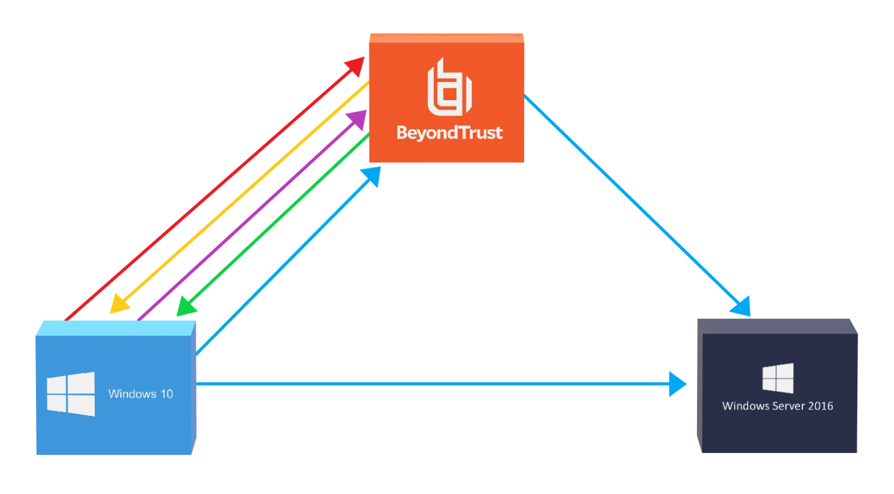
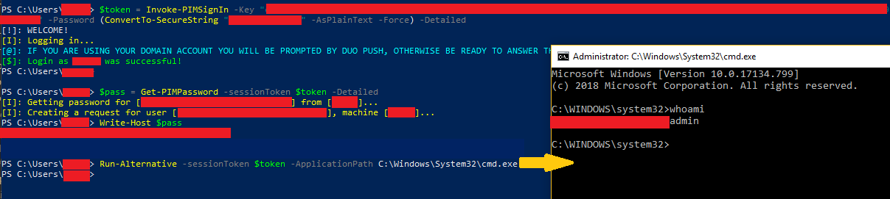
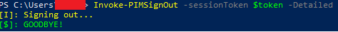

# PowerPIM Modules

The individual PowerShell scripts that make up the PowerPIM framework/toolkit can be ran individually or without the use of the PowerPIM front-end. The method of running these scripts individually, without the use for the front-end would be for anything that would require job automation, batch automation, back-end or system maintenance automation, etc. At the bare minimum, if you implement the individual scripts that make up PowerPIM, into your own custom scripts, you need to pass around the session token. This is explained in more detail below and why this is required.

## JSON Configuration File

The JSON configuration file is stored in **C:\Users\\<username\>\AppData\Roaming\PowerPIM\\Config.json** and is used to store general configuration data pertaining to the overall functionality of the PowerPIM framework/toolkit. This data includes short name-to-full path mappings for the run module, etc. The framework should automatically check for the existence of this file and will create it if it does not exist. However, there may be the one-off change that you need to fix this file or manipulate it in some manner, so knowing of its existence is important.

### A Quick Lesson About Manipulating Different Account Types With PowerPIM

**Disclaimer:** This README assumes that you have a good or at least basic understanding about how an Active Directory environment works. It is your own responsibility to know the difference between a local account and a domain account in an environment that utilizes Active Directory.

At this point you would have authenticated to the API component of the PBPS applicance using the Invoke-PIMSignIn function and store the token data it returns in a variable. In this case the variable will be `$token`. The following is an example on how to grab the password for an active directory or local user account with the Get-PIMPassword function.

#### Domain User Accounts

```powershell
$passwd = Get-PIMPassword -sessionToken $token -User aduser@domain -ComputerName hostname;
```

#### Local User Accounts

```powershell
$passwd = Get-PIMPassword -sessionToken $token -User administrator -ComputerName hostname;
```

### A Quick Lesson about Session Tokens

A quick rundown of what a session token or ID is can be found [here](https://en.wikipedia.org/wiki/Session_ID). In laymen’s terms, you can think of a session token as a pass that you receive when you enter an amusement park. It validates that you paid for access to the amusement park. You pay once at the entrance to the park, not at the booth of every ride and your access to the amusement park is valid until you leave (signing out of the PIM API) or the park closes (session timeout after a couple of hours).



1. **[RED]**<span style="color:#FE2E2E"> I want to authenticate to the PIM API as username@domain. </span>
2. **[YELLOW]**<span style="color:#FFBF00"> PIM/PAM takes the username and password given by the user and checks to see if the credentials stored for this user in Active Directory match. PIM/PAM will also send an MFA challenge to the user at this time. </span>
3. **[PURPLE]**<span style="color:#AC58FA"> The user responds to the MFA challenge with DUO push, yubikey, DUO code, etc. </span>
4. **[GREEN]**<span style="color:#01DF01"> Successful authentication and verification of identity results in a session token (or ‘session state’ as stated by the PBPS API documentation) being created. </span>
5. **[BLUE]**<span style="color:#00BFFF">Subsequent calls to the PIM API (get or reset password, start a rdp session, etc.) use the session token, which shows that you’ve already authenticated. The token is valid until is expires or you make a call to the API endpoint that signs you out. Otherwise, you need to authenticate, and answer the MFA challenge every time you wanted to do something through the PIM API, such as get or change your password or start an rdp session, etc. Additionally, you could also obtain the password to your privileged or administrator account and then directly RDP to the remote using Remote Desktop Connection rather than initiating it through the BeyondTrust applicance.</span>

### Running the back-end scripts

Again, the session token value is the bare minimum requirement you need in order to make calls to the API after authentication. The session token value is returned after calling the Invoke-PIMSignIn.

**Note:** The –Key flag is required and in some cases the –Password flag will be required too if the API key you are using requires you to provide your domain password to use it.

**Note:** If you want to sign into the API as yourself then you need to specify your username in UPN format. If you want to sign in to the API to use a shared or service account then you would specify the username of the local API user on the PIM applicance that manages the specific account you want to use. For example, if the local API user named `wsaapi` manages the shared account name `wsusadmin`, then you would specify `wsaapi` as the value with the –RunAs flag.

**Again**, you must pass the variable that stores the session token if you want to make subsequent calls to the API. Observe below:



**Please make it a habit of signing out when you’re done utilizing the API. Observe below:**



That’s it! You can incorporate the use of these PowerPIM modules with your own custom scripts too! This should avoid the practice of re-inventing the wheel.
